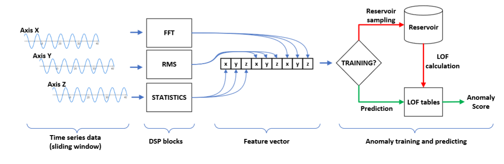

# FogML-Arduino

## Online Anomaly Detection



```
@misc{https://doi.org/10.48550/arxiv.2206.14265,
  doi = {10.48550/ARXIV.2206.14265},
  url = {https://arxiv.org/abs/2206.14265},
  author = {Szydlo, Tomasz},
  keywords = {Machine Learning (cs.LG), FOS: Computer and information sciences, FOS: Computer and information sciences},
  title = {Online Anomaly Detection Based On Reservoir Sampling and LOF for IoT devices},
  publisher = {arXiv},
  year = {2022},
  copyright = {arXiv.org perpetual, non-exclusive license}
}
```

## Classification


```
@inproceedings{DBLP:conf/iccS/SzydloSB18,
  author    = {Tomasz Szydlo and
               Joanna Sendorek and
               Robert Brzoza{-}Woch},
  editor    = {Yong Shi and
               Haohuan Fu and
               Yingjie Tian and
               Valeria V. Krzhizhanovskaya and
               Michael Harold Lees and
               Jack J. Dongarra and
               Peter M. A. Sloot},
  title     = {Enabling Machine Learning on Resource Constrained Devices by Source
               Code Generation of the Learned Models},
  booktitle = {Computational Science - {ICCS} 2018 - 18th International Conference,
               Wuxi, China, June 11-13, 2018, Proceedings, Part {II}},
  series    = {Lecture Notes in Computer Science},
  volume    = {10861},
  pages     = {682--694},
  publisher = {Springer},
  year      = {2018},
}
```
